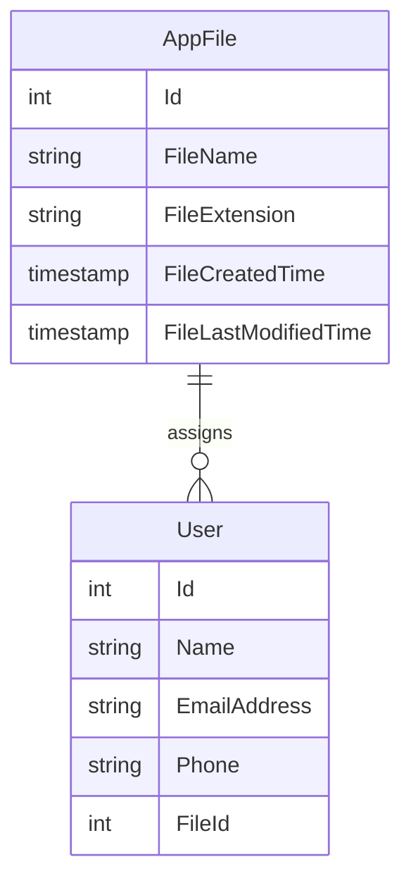

# File Management WPF windows application

Project walkthrough: https://youtu.be/0t6L8D8Iv48

## Project set-up
1. To run this project, open the windowsApplication folder in Visual Studio
2. go to the `MainWindow.xaml` and click run application
3. To change the path that he system is monitoring (currently hardcoded), go to `MainWindow.xaml.cs` and change the private string currentPath.

## Entity Diagram

### Assumptions on requirements
- The application will only track changes of files but not folders within the directory. It is because folders do not have file extension data, which is a required field in the AppFiles SQL Table.
- The File assignment can only be done by Editing AppFile Window but not Edit User Window. This is to prevent Database conflict as two windows can make changes simultaneously.
- Users cannot change the file details such as file extension and file created time from the Windows application, hence these fields are set as read-only in the Edit AppFile window.
- The application can monitor file changes events for Create,Changed, Deleted and Renamed. However, if more events of monitoring are needed, they can be configured in `watcher.NotifyFilter` and adding more event handlers to the `FileSystemWatcher`.

### Things to improve if I had more time
1. Refresh the User Datagrids and AppFile Datagrids when "Save" is clicked on EditUser Window or EditAppFile Window.
2. The best practice for storing the connection string is to use a secure and centralized secrets management system, such as Azure Key Vault or AWS Secrets Manager. The application can then retrieve the connection string from the secrets management system at runtime, avoiding the need to store sensitive information in plain text within the application's configuration files.
3. Disable clicking for the other Datagrid when one is clicked. Even though the database conflict will not happen when both windows are open, it is better to active work on one operation at any time.

### Certain decision making
1. WPF would be a better approach than Windows Forms for this project because it offers better flexibility in designing the user interface (to display data in Datagrids) and has better support for data binding and MVVM architecture, which can make it easier to manage the complex data interactions (i.e. Edit User, Edit App File, Assign File to Users) required by the project.
2. I have used conventional commit messages as it can improved clarity, consistency, and traceability of changes made to the codebase. It can also make it easier to automate tasks such as generating release notes and tracking issues and bugs.
